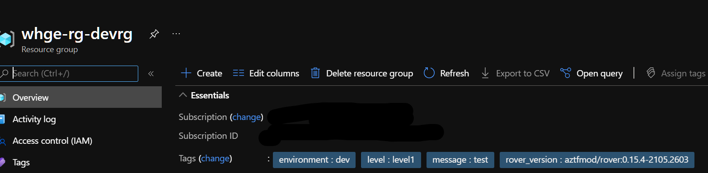
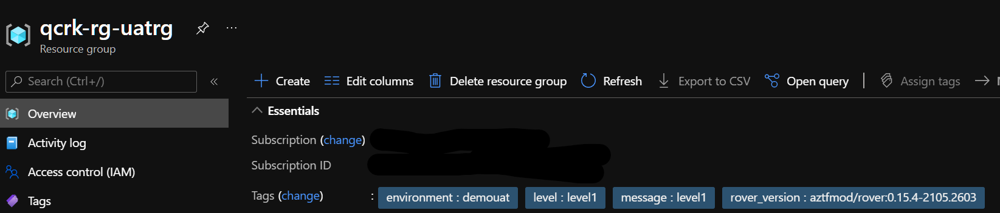

# CAF Config Override Sample

This sample illustrates how to override [Cloud Adoption Framework for Terraform (CAF)](https://github.com/Azure/caf-terraform-landingzones) configurations with environment specific configurations. In the CAF, it's a best practice to have a single set of configurations that you migrate across different environments.

However, in some cases you might want to have environment specific configurations and using environment specific overrides are an important tool to achieve this behavior.

## Considerations

* Environment name does not need to be specified as part of configurations in the tfvars. By using -env, the environment tag will be appended to all resources created by rover/CAF.
* It's a best practice to  use a single set of configurations, since these define your deployed resource. Only include overrides for situations where environment specific configurations are needed.
* While -var-folder is a reference to specific files. -var-file needs to point the specific override file, not a folder.
* You can pass in as many -var-files as you would like to override.
* -var-file should be included in the cli command AFTER -var-folder in order for overrides to work.

## Sample Project

This is a simpe example that deploys a launchpad (taken directly from the starter repo) and a level1 . In level1 we only deploy a resource group for brevity. 

The example includes the following folders:

* landingzones: This has subfolders caf_launchpad and caf_solution, directly from the [CAF Terraform Landing Zones Repo](https://github.com/Azure/caf-terraform-landingzones)
* configs: CAF configurations.
  * level0 and level1: These are base configurations shared across multiple environments.
  * env: This is an overrides folder and you'll notice there is a dev/level one folder underneath. This is where we specify overrides that can be used in the rover deploy command.

## Walk through

---

### Initial Setup
* Clone this repo `git clone `
* Open the repo in vscode. When prompted to re-open in container, select yes.
* Open a terminal window in vs code. Ensure it is a bash terminal. If it's sh, you can open a bash terminal by clicking the + on the right panel.
* `rover login` (login with azure credentials , either as a user or service principal.)
* `export CAF_DIR=$(pwd)`

### Deploy Dev

* Start by deploying the dev environment.
* Note that in level 1 we are providing a var-file to override the customrg.tfvars file based on the env folder (which contains overrides).
  
  *-var-file must appear after -var-folder in order for the override to take precedence.If -var-file was before -var-folder in this example, the values would not be overriden as terraform will process the file first, then the folder.*

```bash

rover -lz $CAF_DIR/landingzones/caf_launchpad \
  -launchpad \
  -var-folder $CAF_DIR/configs/level0/launchpad \
  -parallelism 30 \
  -level level0 \
  -env demodev \
  -a apply \
  -log-severity FATAL

# Important: -var-file should appear AFTER -var-folder
rover -lz  $CAF_DIR/landingzones/caf_solution \
  -tfstate caf_foundations.tfstate \
  -var-folder $CAF_DIR/configs/level1 \
  -var-file $CAF_DIR/configs/env/dev/level1/customrg.tfvars \
  -parallelism 30 \
  -level level1 \
  -env demodev \
  -a apply \
  -log-severity FATAL

```

* Verify the deployment by ensuring that you have a launchpad and one extra resource group with devrg as part of the name and test as the tag.  This matches what is in the [env folder config for level 1.](./configs/env/dev/level1/customrg.tfvars)

  


### Deploy UAT

* Notice in the level one command for the demouat environment, we did not specific an override rile.

```bash

rover -lz $CAF_DIR/landingzones/caf_launchpad \
          -launchpad \
          -var-folder $CAF_DIR/configs/level0/launchpad \
          -parallelism 30 \
          -level level0 \
          -env demouat \
          -a apply \
          -log-severity FATAL

rover -lz  $CAF_DIR/landingzones/caf_solution \
          -tfstate caf_foundations.tfstate \
          -var-folder $CAF_DIR/configs/level1 \
          -parallelism 30 \
          -level level1 \
          -env demouat \
          -a apply \
          -log-severity FATAL
```

* Verify the deployment by ensuring that you have a launchpad and one extra resource group with uatrg as part of the name and level1 as the tag. This matches what is in the [base level 1 config.](./configs/level1/customrg.tfvars)

  